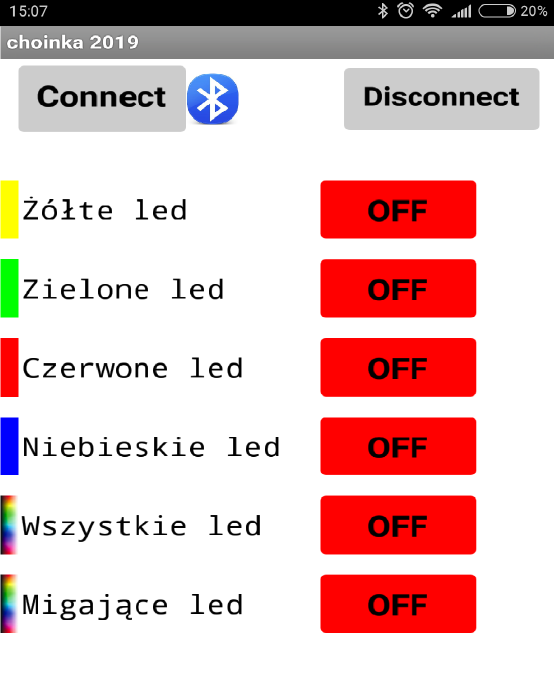

### Create lights for your christmas tree that you can control with app on smartphone (bluetooth). 
## Table of contents
* [How it's done](#How-it's-done)
* [Code in Arduino IDE](#Code-in-Arduino-IDE)
* [App](#app)
* [Sources](#Sources)

## How it's done
I made my Christmas lights myself, 
I mean I took the components, soldering iron ..... and I connected everything to short chain of lights. 
(In the future I recommend creating a minimum distance of 10 cm between the leds :) 
For me there are **20 leds (5 of each color: yellow, green, red and blue)**.
I had **1 kΩ resistors to (-) each diode** so I use this, you can give smaller (e.g. 330Ω) . 
I connected the diodes in parallel, each color separately. One mass for everyone. 
Colors alternate in repetitive order. 
**ESP32 DevKit V1 Module controller.** Pins by schema GPIO pins. 
Application on smartphon written in apponventor. https://appinventor.mit.edu/
## Code in Arduino IDE
```
#include <BLEDevice.h>
#include <BLEServer.h>
#include <BLEUtils.h>
#include <BLE2902.h>

BLECharacteristic *pCharacteristic;
bool deviceConnected = false;
float txValue = 0;

const int Yellow = 5;       //Global, my pins GPIO on EPS32
const int Green = 17;
const int Red = 16;
const int Blue = 4 ;

//  const int Buzz = 23;  //BUZZER 


void Multi()        //led blinking maybe too fast
{
          digitalWrite(Green, LOW);//this
          digitalWrite(Red, LOW);  //this
          digitalWrite(Blue, LOW); //and this may be in class when ->(rxValue.find("K") != -1)
          digitalWrite(Yellow, HIGH);
          delay(500);
          digitalWrite(Yellow,LOW);
          digitalWrite(Green,HIGH);
          delay(500);
          digitalWrite(Green, LOW);
          digitalWrite(Red, HIGH);
          delay(500);
          digitalWrite(Red,LOW);
          digitalWrite(Blue, HIGH);
          
}
boolean M=false; //blinking false

std::string rxValue; 
// See the following for generating UUIDs: https://www.uuidgenerator.net/
#define SERVICE_UUID           "6E400001-B5A3-F393-E0A9-E50E24DCCA9E" // UART service UUID
#define CHARACTERISTIC_UUID_RX "6E400002-B5A3-F393-E0A9-E50E24DCCA9E" //linia odbiorcza
#define CHARACTERISTIC_UUID_TX "6E400003-B5A3-F393-E0A9-E50E24DCCA9E" //linia nadawcza

class MyServerCallbacks: public BLEServerCallbacks {          //Bluetooth device connect 
    void onConnect(BLEServer* pServer) {
      deviceConnected = true;
    };
    void onDisconnect(BLEServer* pServer) {
      deviceConnected = false;
    }
};


class MyCallbacks: public BLECharacteristicCallbacks {         //Value get from device, U can look to appinventor
    void onWrite(BLECharacteristic *pCharacteristic) {
      std::string rxValue = pCharacteristic->getValue();

      if (rxValue.length() > 0) {
       /* Serial.println("*********");                          //What we get
        Serial.print("Received Value: ");
        for (int i = 0; i < rxValue.length(); i++) {
          Serial.print(rxValue[i]);
        }Serial.println();
       */
       
        if (rxValue.find("A") != -1) { 
          Serial.println("Turning ON Yellow!");
          M=false;
          digitalWrite(Yellow, HIGH);
        }
        else if (rxValue.find("B") != -1) {
          Serial.println("Turning OFF Yellow!");
          digitalWrite(Yellow, LOW);      //Yellow on off
        }
        else if (rxValue.find("C") != -1) {
          Serial.println("Turning ON Green!");
          M=false;
          digitalWrite(Green, HIGH);
        }
        else if (rxValue.find("D") != -1) {
          Serial.println("Turning OFF Green!");
          digitalWrite(Green, LOW);       //Green on off
        }
        else if (rxValue.find("E") != -1) {
          Serial.println("Turning ON Red!");
          M=false;
          digitalWrite(Red, HIGH);
        }
        else if (rxValue.find("F") != -1) {
          Serial.println("Turning OFF Red!");
          digitalWrite(Red, LOW);         //Red on off
        }
        else if (rxValue.find("G") != -1) {
          Serial.println("Turning ON Blue!");
          M=false;
          digitalWrite(Blue, HIGH);
        }

        else if (rxValue.find("H") != -1) {
          Serial.println("Turning OFF Blue!");
          digitalWrite(Blue, LOW);           //Blue off
        }
        else if (rxValue.find("I") != -1) {  // All ON
          Serial.println("Turning ON All!");
          M=false;
          digitalWrite(Yellow, HIGH);  
          digitalWrite(Green, HIGH); 
          digitalWrite(Red, HIGH); 
          digitalWrite(Blue, HIGH);       
        }
        else if (rxValue.find("J") != -1) {  //All off
          Serial.println("Turning OFF All!");
          digitalWrite(Yellow, LOW); 
          digitalWrite(Green, LOW);
          digitalWrite(Red, LOW);
          digitalWrite(Blue, LOW);//off
        }
        else if (rxValue.find("K") != -1) {         //Blinking on
          Serial.println("Turning on blinking");
          M=true;                                   //M=true->main loop->if->Multi()
     
        }                                                            
        else if (rxValue.find("L") != -1) {
          Serial.println("Turning OFF All!");
          M=false;
          digitalWrite(Yellow, LOW); 
          digitalWrite(Green, LOW);
          digitalWrite(Red, LOW);
          digitalWrite(Blue, LOW);                  //off all for sure
        }
        //else if (rxValue.find("S") != -1) {
        //  Serial.println("Turning Buzz!");
         // digitalWrite();    }                   //Buzz
    
      }
    }
};

void setup() {
  Serial.begin(115200);

  pinMode(Yellow, OUTPUT);
    pinMode(Green, OUTPUT);
      pinMode(Red, OUTPUT);
        pinMode(Blue, OUTPUT);
        // pinMode(Buzz, OUTPUT); BUZZ

  // Create the BLE Device
  BLEDevice::init("Lampki choinkowe 2019"); // Give it a name example: ESP32 TEST

  // Create the BLE Server
  BLEServer *pServer = BLEDevice::createServer();
  pServer->setCallbacks(new MyServerCallbacks());

  // Create the BLE Service
  BLEService *pService = pServer->createService(SERVICE_UUID);

  // Create a BLE Characteristic
  pCharacteristic = pService->createCharacteristic(
                      CHARACTERISTIC_UUID_TX,
                      BLECharacteristic::PROPERTY_NOTIFY
                    );
                      
  pCharacteristic->addDescriptor(new BLE2902());

  BLECharacteristic *pCharacteristic = pService->createCharacteristic(
                                         CHARACTERISTIC_UUID_RX,
                                         BLECharacteristic::PROPERTY_WRITE
                                       );

  pCharacteristic->setCallbacks(new MyCallbacks());

  // Start the service
  pService->start();

  // Start advertising
  pServer->getAdvertising()->start();
  //Serial.println("Waiting a client connection to notify...");
}

void loop() {
  if (deviceConnected) {   
                            //here we can send something to device or here we can put our class
    if (M==true) Multi();  //from class when (rxValue.find("K") != -1) M=true and i blinking
  }
  delay(500); //for me like in multi
}
```
## App
I do my app on https://appinventor.mit.edu/ "MIT App Inventor is an intuitive, visual programming environment that allows everyone – even children – to build fully functional apps for smartphones and tablets." So, click *create apps!* and create an account. You can add my app to your projects and even edit-that's good for start: *My projects->Import project(.aia)*

<!-- .element height="50%" width="50%" -->

I **download app to smartphon**: `Build->App(provide QR code for .apk)` because if U want add your app on Google Store you must pay $25.
Yes, that was my problem too :) I'm new in this things. 
## Sources
    Video: https://www.youtube.com/watch?v=oCMOYS71NIU
    Based on Neil Kolban example for IDF: https://github.com/nkolban/esp32-snippets/blob/master/cpp_utils/tests/BLE%20Tests/SampleNotify.cpp
    Ported to Arduino ESP32 by Evandro Copercini
